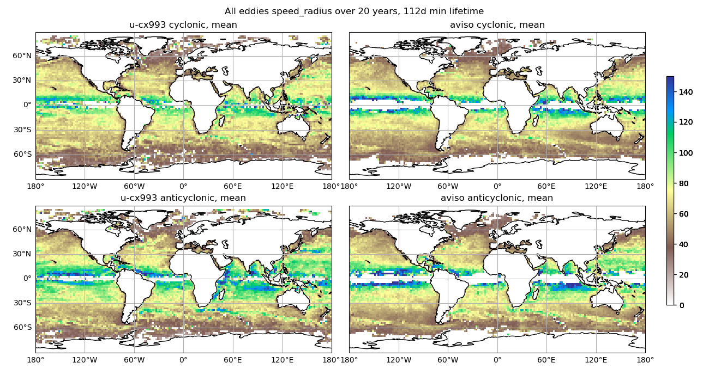
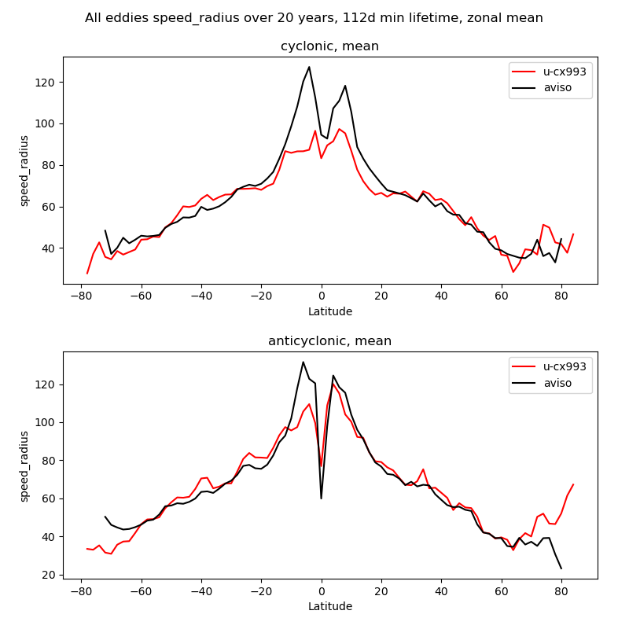
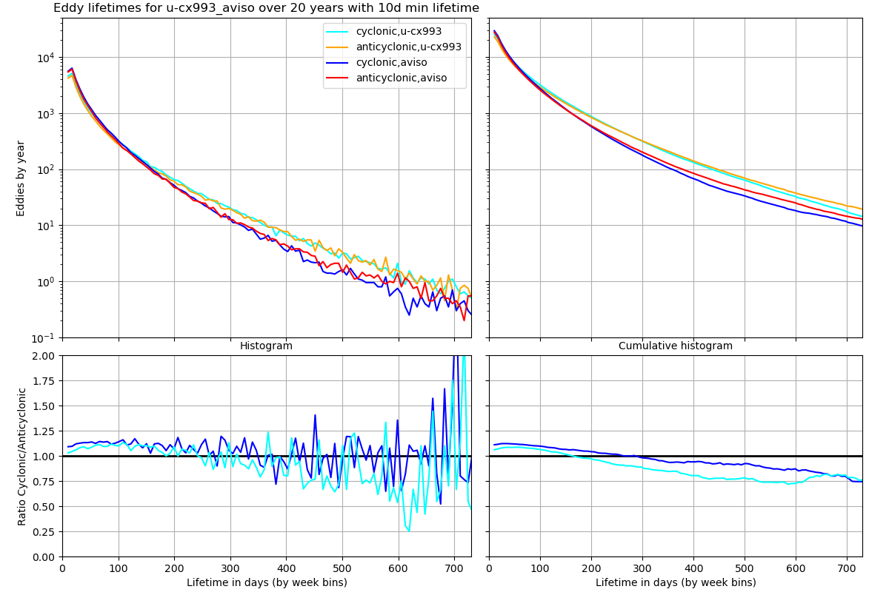

# eddy_tracking
Codes and tools used for ocean eddy tracking

Here we can put any codes/scripts/workflows used for eddy tracking in EERIE for sharing amongst the groups

py_eddy_tracker contains some useful scripts relating to using the py-eddy-tracker code, including some parameter settings (also described in https://docs.google.com/spreadsheets/d/1ZC9Hka-7AF6r27uREU6eUwiTTTqXKQoCM6l2Ar-UYdw/edit#gid=1612043390)

eddy_properties contains code to produce plots using the tracked eddy data from models and AVISO observations (currently based on tracking on a regular 0.25x0.25 grid). 
Some example plots are shown below for the HadGEM3-GC5-EERIE simulation (20km atmos-1/12 ocean, u-cx993) and AVISO. Shown are the eddy size (speed_radius) mean at each point from all eddies over 20 years that last at least 112 days (16 weeks, comparable to Chelton et al., 2011), a zonal mean of this distribution with latitute, and a range of global eddy properties as pdfs.

